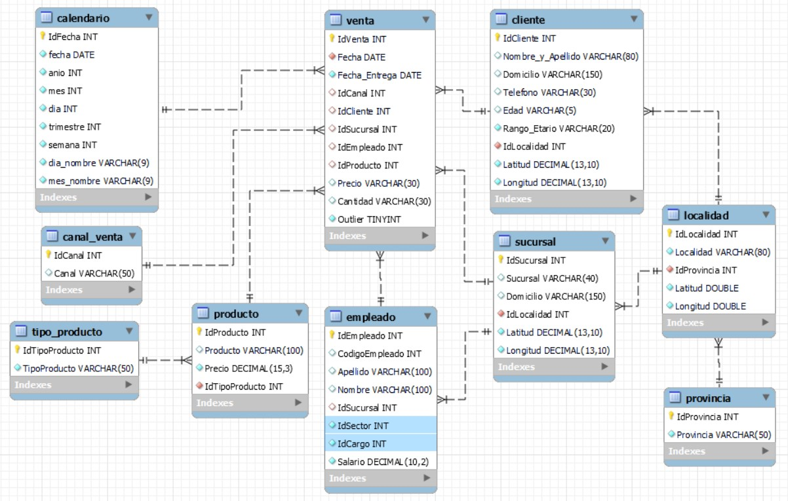

<h1>Bootcamp Módulo 3</h1>

 

<h2>Atención:</h2>

Cómo responder: 

<ul>
<li>Cuando se pida una respuesta numérica, redondear al entero más cercano. </li>
</ul>

Ejemplo: 1.3421 -&gt; 1 

1.8888 -&gt; 2 

<ul>
</ul>
<h2>Responder Verdadero o Falso</h2>
<h2>1) La asignación de índices para las tablas en SQL no genera nunguna mejora en la performance de los queries. </h2>
<h2>2) Las tablas de hechos registran las operaciones ocurridas, todo tipo de transacciones donde intervienen las diferentes entidades del modelo. </h2>
<h2>3) La regla de las 3 sigmas para detección de Outliers está basada en la Mediana. </h2>
<h2>4) Los valores outliers se deben en todos los casos a cargas erróneas de los datos. </h2>
<h2>5) Dada la siguiente consulta SQL:
SELECT Fecha, Count(*) FROM venta GROUP BY Fecha;
Si se pretende filtrar las fechas que contienen más de 10 ventas, es necesario usar la sentencia WHERE </h2>
<h2>Elegir la opción correcta en base a la observación del siguiente DER:</h2>

 

<h2>6) ¿Cuál de las siguientes no es una tabla que representa una dimensión?</h2>

Opciones: 

1- cliente

2- calendario

3- venta

4- provincia

<h2>7) El negocio suele requerir con gran frecuencia consultas a nivel trimestral tanto sobre las ventas, como las compras y los gastos. Teniendo en cuenta el anterior DER, ¿qué sería lo más óptimo a la hora de generar las consultas frecuentes?</h2>

Opciones: 

1- No necesitamos crear más indices, con las claves primarias y foráneas, sería suficiente para cubrir cualquier necesidad de consulta.

2- Sería aduecuado colocar un índice sobre el campo trimestre de la tabla calendario aunque este no sea una clave foránea.

3- No se puede crear índices sobre campos que no son clave.

<h2>8) ¿El DER presentado en la imagen anterior que tipo de modelo sigue?</h2>

Opciones: 

1- Es un Modelo Estrella, porque tiene una sóla tabla de hechos.

2- Eo tiene ningún modelo estipulado, ya que no es un Modelo Estrella, porque contiene referencias circulares.

3- Es un Modelo Copo de Nieve.

<h2>Resuelve las siguientes preguntas:</h2>
<h2>En tu motor de base de datos MySQL, ejecutá las instrucciones del script 'Checkpoint_Create_Insert.sql' (Si no trabajas con MySQL es posible que tengas que realizar algunos ajustes en el script. También están provistas las tablas en formato csv dentro de la carpeta 'tablas_cp'). </h2>

<h2>9) La ganancia neta por producto es las ventas menos las compras (Ganancia = Venta - Compra) ¿Cuál es el tipo de producto con mayor ganancia neta en 2020?</h2>

Opciones: 

1- Informática

2- Impresión

3- Grabacion

<h2>10) A partir de los datos de las Ventas, Compras y Gastos de los años 2020 y 2019, si comparamos mes a mes (ejemplo: junio 2020-junio 2019), ¿Cuál fue el mes cuya diferencia entre ingresos y egresos es mayor? [Ventas (Precio * Cantidad) - Compras (Precio * Cantidad) – Gastos]. Respuesta_Ejemplo: 2  (Refiriendose al segundo mes del año, Febrero. OJO, sólo coloca el número de mes, no el nombre del mes)</h2>

<h2>11) Del total de clientes que realizaron compras en 2020, ¿Qué porcentaje no había realizado compras en 2019?</h2>

Opciones: 

1-0.45 

2-0.38 

3-0.41 

4-0.51

<h2>12) Del total de clientes que realizaron compras en 2019, ¿Qué porcentaje lo hizo también en 2020?</h2>

Opciones: 

1-0.88 

2-0.90 

3-0.82 

4-0.85

<h2>13) ¿Qué cantidad de clientes realizó compras sólo por el canal presencial entre 2019 y 2020?</h2>

Opciones: 

1-0.23

2-0.15 

3-0.47 

4-0.33

<h2>14) El sector de Marketing desea saber cuál sucursal tiene la mayor ganancia neta en el 2020,(Ganancia = suma_total(Venta - Gasto) ¿Cuál es la sucursal con mayor ganancia neta en 2020?</h2>

Opciones: 

1- Alberdi

2- Flores

3- Corrientes

<h2>15) Del total de clientes que realizaron compras en 2019, ¿Qué porcentaje lo hizo sólo en una única sucursal?</h2>

Opciones: 

1-0.45 

2-0.64

3-0.41 

4-0.51
<h2>Pablo es un estudiante de la carrera de Data Science en Henry, por lo que le interesa saber un poco más sobre las remuneraciones del área. Para esto, cuenta con un script de carga SQL llamado "Checkpoint_Create_Insert_salaries_SE.sql" donde posee sólo datos para "experiencia=SE' pero además, un csv llamado "ds_salaries_SIN_SE.csv" donde contiene el resto de los registros con otros valores para el campo "experiencia", con lo que decide hacer un ETL, ejecutando el primer script para crear la tabla y cargar los datos, pero adicionando los datos del CSV. (Si no trabajas con MySQL es posible que tengas que realizar algunos ajustes en el script. También están provistas las tablas en formato csv dentro de la carpeta 'tablas_cp').</h2>
<h2>16) ¿ Cuántos países NO tienen información sobre los salarios de sus Data Scientists?</h2>

<h2>17) ¿Cuál es el promedio de salarios en usd de los Data Scientist de la muestra en 2020?</h2>

<h2>18) Si consideramos el tipo de cambio como el salario en moneda local dividido el salario en USD, ¿cuál es el mayor valor de esta variable en la muestra ?</h2>

